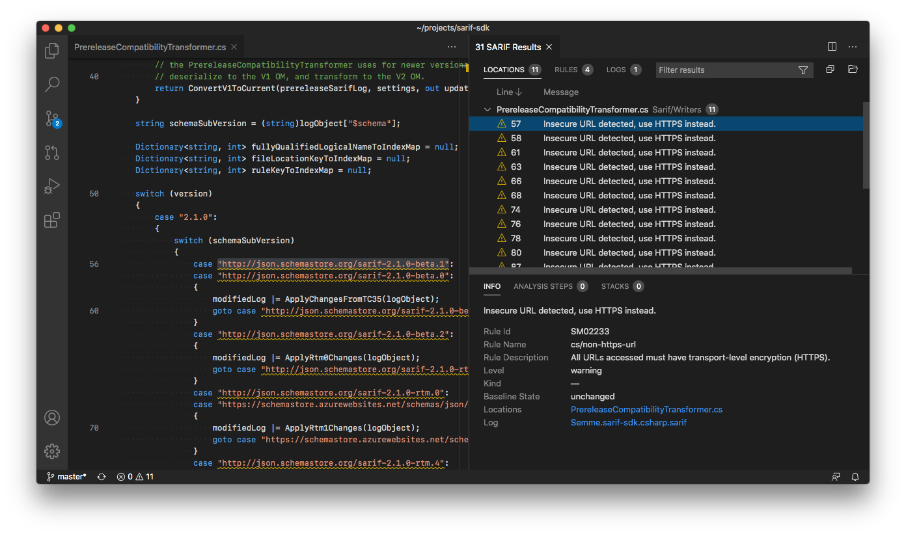

# SARIF Viewer for Visual Studio Code

A [Visual Studio Code](https://code.visualstudio.com/)
[extension](https://marketplace.visualstudio.com/VSCode) that adds support for
viewing [SARIF](https://sarifweb.azurewebsites.net/) logs. SARIF log results can
be viewed as squiggles in your source, in the Problems list, or in a dedicated
**SARIF Results Panel**. The **SARIF Results Panel** offers richer grouping,
filtering, column, and details options over the standard Problems list.



## What's New?

Version 3 incorporates many feedback-based improvements:

-   Improved keyboard accessibility within the **SARIF Results Panel**. Arrow
    key through the list of results.
-   Resizable details section within the **SARIF Results Panel**.
-   Generally improved performance and responsiveness.
-   Automatic reconciliation of URIs between the SARIF log and your local
    workspace in most cases.

To focus our efforts, we have dropped some less-used and less-reliable features:

-   Support for old SARIF versions - We now strictly support the public standard
    version 2.1.0. Older versions can be upgraded with the standalone SARIF
    Multitool (via [nuget](https://www.nuget.org/packages/Sarif.Multitool/) and
    [npm](https://www.npmjs.com/package/@microsoft/sarif-multitool)).
-   Conversion of external formats to SARIF - We recommend the standalone SARIF
    Multitool (via [nuget](https://www.nuget.org/packages/Sarif.Multitool/) and
    [npm](https://www.npmjs.com/package/@microsoft/sarif-multitool)) for
    conversion.
-   **SARIF Results Panel** (previously "SARIF Explorer") view state is no
    longer exposed as settings.
-   The `rootpaths` setting as been removed.

If these changes adversely affect your project, please
[let us know](https://github.com/microsoft/sarif-vscode-extension/issues).

## 🛠️ Usage

Install this extension from the
[Extension Marketplace](https://code.visualstudio.com/docs/editor/extension-gallery)
within Visual Studio Code.

SARIF logs (`*.sarif`) can be opened several ways:

-   Open as a document. The **SARIF Results Panel** will automatically be shown.
-   Manually show the **SARIF Results Panel** with command `sarif.showPanel`.
    Then click "Open SARIF log". If logs are already open, open additional logs
    via the folder icon at the top of the **SARIF Results Panel**.
-   Call from another extension. See the "API" section below.

We welcome feedback via
[issues](https://github.com/microsoft/sarif-vscode-extension/issues).

## API

An
[extension-to-extension public API](https://code.visualstudio.com/api/references/vscode-api#extensions)
is offered. This API is defined at `src/extension/index.d.ts`. An example of
another extension calling this extension:

```javascript
const sarifExt = extensions.getExtension("MS-SarifVSCode.sarif-viewer");
if (!sarifExt.isActive) await sarifExt.activate();
await sarifExt.exports.openLogs([Uri.file("c:/samples/demo.sarif")]);
```

Note: TypeScript typings for `Extension<T>` are forthcoming.

## Telemetry

We collect basic anonymous information such as activation and the
versions/schemas of any logs opened. Opt-in or out via the general Visual Studio
Code setting `telemetry.enableTelemetry`.

## Development

`F5` launches this extension. Subsequent changes are watched and rebuilt. Use
command `workbench.action.reloadWindow` to see the changes. For more details see
[Contributing to SARIF Viewer](CONTRIBUTING.md).

Other common tasks:

| Command                                  | Comments                                                               |
| ---------------------------------------- | ---------------------------------------------------------------------- |
| `npm run server`                         | Run the `Panel` standalone at `http://localhost:8000`. Auto-refreshes. |
| `npm test`                               | Run and watch unit tests. Bails on failure. Useful during development. |
| `npm test -- --bail false --watch false` | Run tests once. Useful for reporting.                                  |
| `npx webpack`                            | Build manually.                                                        |
| `npx @vscode/vsce package`               | Produce a VSIX.                                                        |
